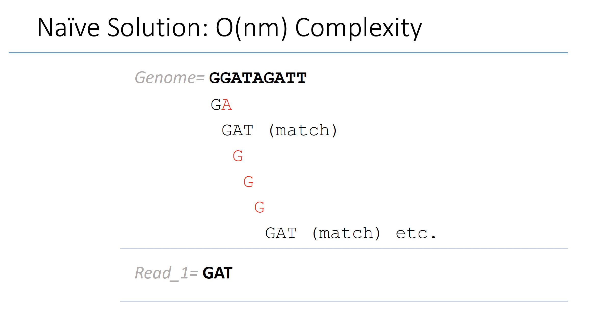

# Summary of key points covered in exact matching

We first set up the question, what is exact matching between two strings and provide a naive solution with O(nm) time complexity.

To improve the time complexity, we introduce a better solution utilizing an efficient data structure called suffix tree, I would like to refer you
to [suffix tree wikipedia](https://en.wikipedia.org/wiki/Suffix_tree) page to correspond what we learned in class to the general formal definition. Especially pay attentions to the label of edges (it is a substring instead of a character). Using suffix tree can reduce the whole time complexity down to O(n+m).

While suffix tree has better time complexity, building the suffix tree is not memory efficient. So we instroduce suffix array, again, let me refer you to [suffix array wikipedia](https://en.wikipedia.org/wiki/Suffix_array) page for general definition. Since it only stores the numbers, the memory usage is lowered.

We can make the memory even more efficient, by using Burrow Wheeler Transform (BWT) and FM index. BWT itself is just a transform of the original string to have more consecutive repeats for compression purpose (last column of the rotation matrix). See [BWT wikipedia](https://en.wikipedia.org/wiki/Burrows%E2%80%93Wheeler_transform) page for more illustrations. It has nothing to do with alignment itself. But we can utilize BWT and its LF mapping property to perform (a) reconstruction of original text, (b) exact matching. In practice, we store the index through FM index, which I'd like to refer you to [FM-index wikipedia](https://en.wikipedia.org/wiki/FM-index) page for what it is and how it relates to BWT.

With these background knowledge of exact matching problem, we can finally delve into a seminal research paper [Bowtie](https://genomebiology.biomedcentral.com/articles/10.1186/gb-2009-10-3-r25) to get a glimpse of how all we have learned played out in real-world problem, and argubly laid the foundations for the whole bioinformatics field in the past decade. 

# Further reading

1. [Bowtie2](https://www.nature.com/articles/nmeth.1923)

2. [BWA](https://academic.oup.com/bioinformatics/article/25/14/1754/225615)

3. [BWA-MEM](https://arxiv.org/abs/1303.3997)

4. [TopHat](https://pubmed.ncbi.nlm.nih.gov/19289445/)

5. [STAR](https://www.ncbi.nlm.nih.gov/pmc/articles/PMC3530905/)

