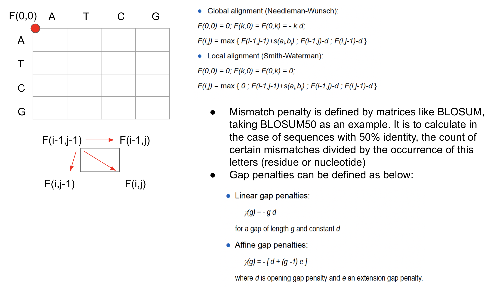

# Inexact match

In biology, it is very important to conduct inexact matching due to evolutional pressure and potential sequencing error. The computational costs for 
inexact match is way more expensive than exact match. As an naive algorithm considering align two sequence, sequence 1 of length n and sequence 2 of length m and allow gap and mismatches. It can be viewed as a problem of having `n+m` slots and try to put `n` letters from sequence 1 into these slots. In this regard, the time complexity is `choose n from (n+m)`.

More efficient way is to use dynamic programming via an alignment graph.

Dynamic programming can help you find optimal alignment, but it is computationally expensive as well. So as an trade-off, BLAST uses heuristic to first do exact match for "seed sequence" along the whole genome, and then extend the matched seed using Dynamic programming. BLAT is another variant of BLAST. PSI-BLAST can increase the sensitivity by iteratively do BLAST by updating the penalty/mismtaches matrix via incorporating the hits obtained from last round.